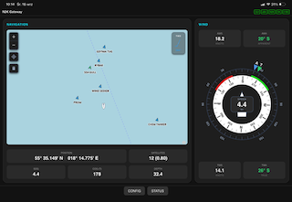
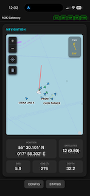

# ESP32 NMEA2000 Multiprotocol Gateway

  
  

This project is an ESP32-based marine gateway for NMEA 2000 networks. It listens to the CAN bus, decodes navigation and engine data, and publishes it over multiple interfaces such as Signal K, NMEA 0183, and Actisense Binary. It also includes AIS parsing, filtering, and display functions for vessel targets and AIS Aids to Navigation (AtoN).

The firmware includes a built-in web dashboard for monitoring vessel status, routing sources, diagnostics, and basic navigation data in a compact browser-based GUI.

---

## Key Features

- Signal K output over WebSockets for marine software and apps (API and Delta over WebSocket)
- NMEA 0183 output over TCP/UDP
- Actisense Binary output for compatible navigation software over TCP/UDP
- CAN bus decoding for NMEA 2000 device data and vessel parameters
- AIS parsing and tracking for vessel targets and AtoN marks
- Web-based configuration and diagnostics interface
- Built-in dashboard with map view, instruments, engine data, tank status, and system status
- Source arbitration and preferred-device selection for competing sensors
- Demo mode for testing without a live NMEA 2000 network

---

## Project Layout

- [release/](release/) — prebuilt firmware binaries for different board variants
- [docs/](docs/) — installation guide, user manual, and hardware profile documentation

---

## Quick Start

1. Go to [release/](release/) and download the correct firmware binary for your hardware.
2. Flash the board using the browser-based ESP tool or your preferred ESP32 flashing method.
3. Connect to the gateway WiFi access point created by the device.
4. Open the local web UI at http://192.168.4.1
5. Configure WiFi, CAN pins, and output services from the web interface.

For detailed installation and wiring instructions, use the documents in [docs/](docs/).

---

## Documentation

The project documentation is located in [docs/](docs/) and includes:

- [docs/Hardware_profiles.md](docs/Hardware_profiles.md) — hardware variants, pinouts, and board-specific notes
- [docs/N2K multi protocal  gateway  Installation Guide.md](docs/N2K%20multi%20protocal%20%20gateway%20%20Installation%20Guide.md) — flashing, WiFi setup, CAN wiring, first boot, and basic installation flow
- [docs/N2K multi protocal  gateway user_manual.md](docs/N2K%20multi%20protocal%20%20gateway%20user_manual.md) — operational manual describing dashboard, configuration, Signal K, AIS, and output streams

---

## Important Notes

- This is an open-source community project, not a certified marine safety device.
- The gateway is intended as a marine integration tool and should not be treated as a primary navigational safety system.
- Always use qualified marine equipment and keep human supervision during navigation.

---

## License

Please see [LICENSE.md](LICENSE.md) for the full licensing terms.
