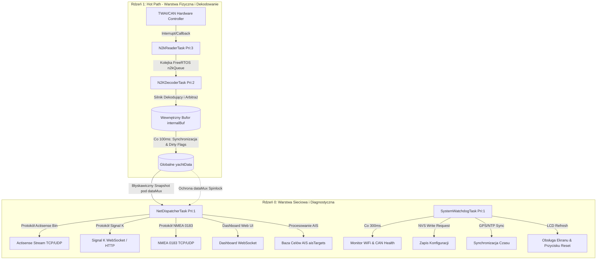
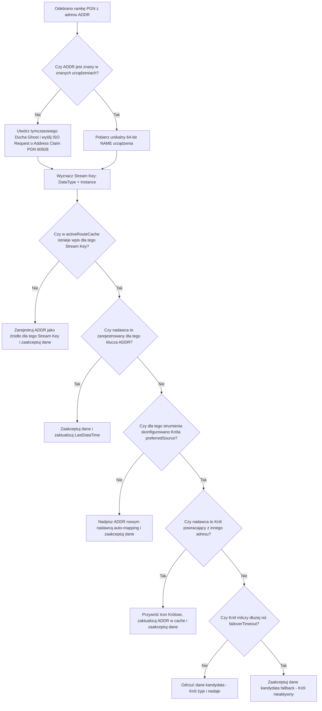
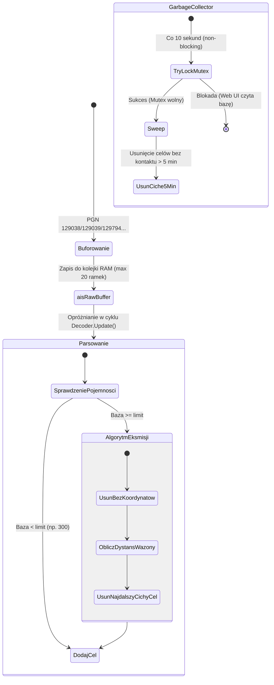

# Architektura Systemu i Przepływ Danych (Wersja v2)

Niniejszy dokument przedstawia szczegółowy opis architektury technicznej bramki **ESP32 NMEA 2000 Gateway**. Opisuje on wewnętrzną organizację kodu, dystrybucję zadań w środowisku wielordzeniowym systemu FreeRTOS, mechanizmy bezblokadowej synchronizacji pamięci oraz algorytmy przetwarzania danych pomiarowych i celów AIS.

---

## 1. Filozofia Asymetrycznego Przetwarzania Wielordzeniowego (Dual-Core)

Mikrokontrolery ESP32 posiadają dwa niezależne, 32-bitowe rdzenie Xtensa (rdzeń 0 i rdzeń 1) taktowane zegarem do 240 MHz. Aby zagwarantować, że bramka nigdy nie zgubi krytycznych ramek z fizycznej magistrali CAN (np. szybkich komunikatów głębokości lub pozycji GPS przy częstotliwościach do 10 Hz), architektura systemu opiera się na **asymetrycznym podziale zadań** pomiędzy oba rdzenie:



### Specyfikacja Zadań FreeRTOS (Task Allocation)

| Nazwa zadania | Rdzeń | Priorytet | Okres (Delay) | Główna funkcja i odpowiedzialność |
| :--- | :---: | :---: | :---: | :--- |
| **`N2kReaderTask`** | **1** | 3 | 1 ms | Obsługa biblioteki `NMEA2000` (`ParseMessages()`). Odczyt z buforów sprzętowych TWAI (CAN). Dynamiczne zarządzanie adresem urządzenia (Address Claiming) z 5-sekundowym filtrem drgań (debounce) przed zaplanowaniem zapisu do pamięci NVS. |
| **`N2KDecoderTask`** | **1** | 2 | 2 ms (min. 50ms timeout) | Pobieranie komunikatów z `n2kQueue`. Filtrowanie przez Silnik Arbitrażu. Dekodowanie PGN-ów do bufora lokalnego `internalBuf`. Co 100 ms wywołanie `Decoder.Update()` i przeniesienie zmian do globalnej struktury `yachtData` z ustawieniem odpowiednich masek modyfikacji (Dirty Flags). |
| **`NetDispatcherTask`** | **0** | 1 | 10 ms | Pobranie szybkiej kopii danych (`yachtData`) i konfiguracji (`deviceConfig`) pod ochroną spinlocków. Dystrybucja danych do modułów: Actisense Binary, Signal K WebSocket, Web Dashboard, NMEA 0183, procesora AIS. Po udanym wysłaniu, atomowe czyszczenie flag zmian (Acknowledge & Clear). |
| **`SystemWatchdogTask`** | **0** | 1 | 300 ms | Pętla diagnostyczna. Monitorowanie stanu połączenia Wi-Fi (`checkWiFiConnection()`) i magistrali CAN (`CheckCANHealth()`), synchronizacja czasu GPS z zegarem systemowym, odświeżanie wyświetlacza LCD, sprawdzanie stanu przycisku resetu fabrycznego, realizacja odroczonego zapisu parametrów do NVS (`checkDeferredSave()`). |

---

## 2. Mechanizmy Synchronizacji Pamięci Współdzielonej

Wielowątkowy odczyt i zapis danych na architekturze dwurdzeniowej ESP32 niesie za sobą ryzyko wyścigu (race conditions), zakleszczeń (deadlocks) oraz błędów częściowego odczytu struktur 64-bitowych (torn reads). W celu uniknięcia narzutu czasowego FreeRTOS oraz uśpienia wątków o wysokim priorytecie (co skutkowałoby przepełnieniem sprzętowych buforów CAN i gubieniem ramek), zastosowano hybrydową strategię synchronizacji:

### A. Kolejkowanie ramek (`n2kQueue`)
Komunikacja pomiędzy producentem ramek (`N2kReaderTask`) a ich konsumentem (`N2KDecoderTask`) opiera się na kolejce FreeRTOS o stałym rozmiarze `N2KQUEUESIZE` (zazwyczaj 100 elementów). Kopiowanie ramki odbywa się bez oczekiwania (timeout = 0) wewnątrz callbacku `HandleN2kMsg`. Jeśli kolejka jest pełna, licznik `lostMessages` w strukturze `systemState` jest inkrementowany, a ramka zostaje pominięta, co zapobiega zablokowaniu sterownika CAN.

### B. Hardware Spinlocks (`portMUX_TYPE`)
Dla ochrony struktur w pamięci RAM zastosowano sprzętowe blokady wirujące (spinlocks), które czasowo wyłączają przerwania na danym rdzeniu na czas ułamka mikrosekundy. W systemie zdefiniowano cztery dedykowane spinlocki:
*   **`dataMux`:** Chroni główną strukturę stanu jachtu `yachtData` podczas kopiowania danych i modyfikacji bitowych masek zmian.
*   **`configMux`:** Chroni parametry operacyjne bramki `deviceConfig` (np. piny, tryby, reguły arbitrażu) przed jednoczesnym odczytem przez dispatcher i zapisem z poziomu serwera Web UI.
*   **`deviceListMux`:** Chroni mapę `knownDevices` przed jednoczesnym przeszukiwaniem przez Silnik Arbitrażu a modyfikacjami (wykrycie nowego urządzenia, usunięcie nieaktywnego urządzenia przez garbage collector).
*   **`cacheMux` i `nameMux`:** Chronią szybki cache routingu (`activeRouteCache`) oraz tablicę adresów `addressToName` wewnątrz dekodera.

### C. Zmienne Atomowe (`std::atomic`)
Metadane diagnostyczne i operacyjne, zdefiniowane w strukturze `tSystemState`, wykorzystują typy atomowe z biblioteki standardowej C++ (`std::atomic`). Pozwala to na w pełni bezblokadowy odczyt i zapis pojedynczych zmiennych (takich jak obciążenie magistrali, statusy połączeń sieciowych, liczniki klientów czy czasy wykonania zadań WCET/ACET) z dowolnego rdzenia.

### D. Mechanizm Snapshotów i Trójfazowy Cykl Dispatchera
Zadanie sieciowe `NetDispatcherTask` pobiera dane z `yachtData` w ściśle kontrolowany sposób:
1.  **Faza Snapshotu (Kopiowanie):** Dispatcher wchodzi w sekcję krytyczną `dataMux`, wykonuje błyskawiczne `memcpy` całej struktury `yachtData` do lokalnego bufora `snap` i natychmiast opuszcza sekcję krytyczną. Trwa to poniżej 2 mikrosekund.
2.  **Faza Przetwarzania (Dystrybucja):** Na podstawie kopii `snap` dispatcher wykonuje czasochłonne operacje formatowania ciągów JSON, Signal K czy NMEA 0183 i wysyła je przez sieć bez blokowania rdzenia 1.
3.  **Faza Acknowledge & Clear (Zerowanie Flag):** Po pomyślnym przesłaniu danych dla danego protokołu, dispatcher wchodzi ponownie w sekcję krytyczną `dataMux` i odejmuje przesłane flagi za pomocą operacji bitowej:
    ```cpp
    portENTER_CRITICAL(&dataMux);
    yachtData.statusSK.all &= ~snap.statusSK.all;
    portEXIT_CRITICAL(&dataMux);
    ```
    Dzięki temu, jeśli w trakcie wysyłania danych przez Wi-Fi dekoder na Core 1 zapisał nową wartość parametru i ustawił jego flagę na `1`, flaga ta nie zostanie nadpisana ani wyczyszczona – system zarejestruje nową zmianę w kolejnym cyklu.

---

## 3. Silnik Arbitrażu Danych i Zarządzanie Źródłami (The "King" Concept)

Gdy na jachcie zainstalowanych jest kilka czujników tego samego typu (np. dwa odbiorniki GPS lub dwa wiatromierze), system musi decidir, które dane przekazać do wyświetlaczy, a które odrzucić. Do tego celu służy **Silnik Arbitrażu**, zaimplementowany w klasie `tN2kDataDecoder`.



### Charakterystyka Techniczna Silnika Arbitrażu:

1.  **Identyfikacja po unikalnym NAME:**
    Urządzenia są identyfikowane za pomocą 64-bitowego kodu `NAME` (zawierającego kod producenta, unikalny numer seryjny, klasę i funkcję urządzenia), a nie zmiennego adresu CAN (Source Address).
2.  **Szybki Mikro-Cache (`activeRouteCache`):**
    Aby zapobiec alokacji pamięci na stercie (heap) wewnątrz pętli dekodera, routing jest sprawdzany w płaskiej tablicy o stałym rozmiarze 64 wpisów:
    ```cpp
    struct tRouteCacheEntry {
        uint16_t streamKey;     // [8 bitów DataType][8 bitów Instance]
        uint8_t address;        // Aktualny 8-bitowy adres CAN
        tN2kDevice* devicePtr;  // Wskaźnik do pełnych metadanych urządzenia (Króla)
    };
    ```
    Wyszukiwanie i walidacja źródła odbywa się w czasie $O(N)$ dla maksymalnie 64 elementów, co w praktyce zajmuje poniżej 0.5 mikrosekundy.
3.  **Algorytm Failover (Obsługa Awarii):**
    Jeśli skonfigurowany jako preferowany czujnik ("Król") ulegnie awarii lub straci zasilanie, system sprawdza jego czas ostatniej aktywności (`LastDataTime`). Jeśli różnica czasu przekroczy próg:
    $$\text{failoverTimeout} = \text{DATA\_TIMEOUTS}[\text{DataType}] \times 1.5$$
    bramka zaczyna tymczasowo akceptować dane z pierwszego alternatywnego źródła ("Kandydata").
4.  **Odzyskiwanie Tronu (Reclaiming):**
    Gdy preferowane urządzenie ("Król") wznowi nadawanie, silnik arbitrażu natychmiast wykrywa jego ramkę (po dopasowaniu adresu CAN skojarzonego z 64-bitowym `NAME` zapisanym w konfiguracji), nadpisuje adres kandydata w cache i przywraca priorytet "Królowi".
5.  **Obsługa "Duchów" (Ghosts):**
    Jeśli bramka zacznie otrzymywać pakiety z adresu CAN, który nie zgłosił jeszcze Address Claim (np. po wpięciu urządzenia na "gorąco"), system tworzy w RAM wirtualne urządzenie z syntetyczną nazwą `0xFFFFFFFFFF000000 | addr` ("Duch"). Pozwala to na natychmiastowe przetwarzanie danych z nowego źródła. Jednocześnie system wysyła żądanie ISO Request (PGN 60928) w celu pobrania rzeczywistego profilu urządzenia. Po odebraniu właściwej ramki Address Claim, "Duch" zostaje usunięty, a cache przebudowane.

---

## 4. Przetwarzanie i Kondycjonowanie Sygnałów (Filtry EMA)

Czujniki morskie, w szczególności wiatromierze (bujające się na topie masztu) oraz kompasy i logi, generują zaszumione dane wyjściowe. Przed zapisem do pamięci globalnej dane te przechodzą przez cyfrowy filtr dolnoprzepustowy typu **Exponential Moving Average (EMA)**:

$$y_n = \alpha \cdot x_n + (1 - \alpha) \cdot y_{n-1}$$

Gdzie:
*   $x_n$ – nowo odebrana wartość fizyczna,
*   $y_{n-1}$ – poprzednia przefiltrowana wartość,
*   $\alpha$ – współczynnik tłumienia dobrany z tablicy `DAMPING_ALPHA` na podstawie poziomu damping (0-10) wybranego przez użytkownika:

```cpp
const double tN2kDataDecoder::DAMPING_ALPHA[11] = {
    1.00, // 0: Filtrowanie wyłączone (Alpha = 1.0)
    0.50, 0.35, 0.20, 0.15, 
    0.10, // 5: Średnie tłumienie
    0.08, 0.06, 0.04, 0.02, 
    0.01  // 10: Maksymalne tłumienie (bardzo wolna reakcja)
};
```

### Specjalna Obsługa Kątów (`SmoothAngle`)
Dla parametrów kołowych (np. kąt wiatru, kurs kompasowy) zwykła średnia arytmetyczna EMA prowadziłaby do poważnych błędów w pobliżu przejścia przez zero (np. uśrednienie $359^\circ$ i $1^\circ$ dałoby błędne $180^\circ$ zamiast prawidłowego $0^\circ$). 
Silnik dekodera rozwiązuje to poprzez wyznaczanie różnicy kątowej na okręgu jednostkowym i normalizację w radianach:
```cpp
double diff = newAngleRad - oldAngleRad;
while (diff < -M_PI) diff += 2.0 * M_PI;
while (diff > M_PI)  diff -= 2.0 * M_PI;
return NormalizeAngleRad(oldAngleRad + alpha * diff);
```
Zapewnia to stabilne i płynne ruchy wskazówek instrumentów na ekranach bez generowania anomalii przy przejściu przez północ ($0^\circ$).

---

## 5. Architektura Silnika AIS i Kontrola Pamięci

Komunikaty systemu AIS (Automatic Identification System) generują znaczny ruch na magistrali. W obszarach o dużym natężeniu ruchu (np. w pobliżu portów) liczba celów AIS może przekroczyć możliwości pamięci RAM mikrokontrolera ESP32. W tym celu wdrożono zoptymalizowany podsystem zarządzania celami AIS:



### Kluczowe komponenty systemu AIS:
1.  **Dwuetapowe Buforowanie wejściowe:**
    Aby zapobiec blokowaniu głównej pętli dekodera CAN, surowe komunikaty AIS są najpierw tymczasowo odkładane w buforze typu `std::vector` (`aisRawBuffer`, limitowany do 20 ramek). Odczyt i zapis do chronionej mutexem `aisMutex` mapy `aisTargets` odbywa się asynchronicznie podczas fazy aktualizacji dekodera.
2.  **Inteligentny Algorytm Eksmisji (Eviction Engine):**
    Jeśli baza danych celów osiągnie maksymalny zdefiniowany limit (np. 300 statków), a pojawi się nowy cel, system wykonuje procedurę zwolnienia miejsca (`EnsureAISTargetCapacity`):
    *   **Krok 1:** Usuwane są z pamięci te cele, które nie posiadają ważnych współrzędnych geograficznych (szerokości/długości geograficznej).
    *   **Krok 2:** Obliczany jest kwadrat odległości geograficznej pomiędzy pozycją własną jachtu (`yachtData.Latitude`/`Longitude`) a pozycją celu AIS.
    *   **Krok 3:** Wprowadzana jest kara za milczenie: odległość celów, które nie nadały danych dynamicznych w ciągu ostatnich 60 sekund, zostaje sztucznie podwojona (zwiększając priorytet ich eksmisji).
    *   **Krok 4:** Cel o najwyższym wskaźniku kary (najdalszy i najbardziej milczący) jest trwale usuwany z pamięci, robiąc miejsce dla nowego statku.
3.  **Bezblokadowy Garbage Collector:**
    Raz na 10 sekund na rdzeniu 0 w tle uruchamia się proces czyszczenia starych wpisów. Wykorzystuje on próbę bezwarunkowego zajęcia semafora bez oczekiwania: `xSemaphoreTake(aisMutex, 0)`. Jeśli serwer HTTP/WebSockets aktualnie przesyła listę statków do przeglądarki użytkownika i blokuje mutex, Garbage Collector natychmiast rezygnuje z działania i odkłada sprzątanie na kolejny cykl. Zapobiega to jakimkolwiek mikro-przycięciom w działaniu interfejsu sieciowego. Po pomyślnym zajęciu mutexu usuwane są statki, z którymi nie było kontaktu od ponad 5 minut.

---

## 6. System Diagnostyki, Watchdog i Auto-recovery

Stabilność pracy w trudnym środowisku jachtowym wymaga zaawansowanych mechanizmów odporności na błędy:

1.  **Integracja z Hardware Task Watchdog (WDT):**
    Inicjalizowany w ESP-IDF systemowy watchdog nadzoruje krytyczne zadania na obu rdzeniach. Zadania `N2kReaderTask`, `N2KDecoderTask` oraz `NetDispatcherTask` muszą regularnie raportować swoją sprawność poprzez wywołanie `esp_task_wdt_reset()`. W przypadku zawieszenia się któregokolwiek z procesów (np. z powodu nieskończonej pętli lub blokady na sieci), system automatycznie zrestartuje mikrokontroler w ciągu 15 sekund.
2.  **Detekcja Przyczyn Resetu (`checkResetReason()`):**
    Podczas uruchomienia urządzenia, bramka bada rejestry procesora w celu określenia powodu ostatniego restartu. W przypadku wykrycia restartu spowodowanego przez Watchdog lub błąd sprzętowy (Software Panic), system ustawia flagę `systemState.systemCrashedPreviously = true`, co jest natychmiast raportowane w panelu diagnostycznym Dashboardu w celu poinformowania użytkownika o zaistniałym problemie.
3.  **Monitorowanie zdrowia magistrali CAN (`CheckCANHealth()`):**
    Bramka stale odpytuje sterownik TWAI o szczegółowe statystyki błędów magistrali fizycznej:
    ```cpp
    twai_status_info_t status_info;
    twai_get_status_info(&status_info);
    ```
    W przypadku wykrycia stanu `BUS-OFF` (spowodowanego zwarciem na kablu NMEA 2000 lub brakiem terminatorów rezystancyjnych 120 Ohm), system automatycznie odłącza wyjścia sieciowe bramki, zmienia stan w strukturze diagnostycznej na czerwony alarm i podejmuje próby programowej reinitacji sterownika CAN.
4.  **Asynchroniczny Logger (`AsyncLogger`):**
    Wypisywanie logów diagnostycznych bezpośrednio na port szeregowy (`Serial.printf`) z poziomu przerwań lub zadań o wysokim priorytecie generuje ogromne opóźnienia i może zablokować procesor. W tym celu logi są przesyłane do szybkiego, kołowego bufora pamięci RAM, a ich fizycznym wypisywaniem na port UART zajmuje się niskopriorytetowe zadanie `SystemWatchdogTask` na Core 0 w wolnych cyklach procesora.
